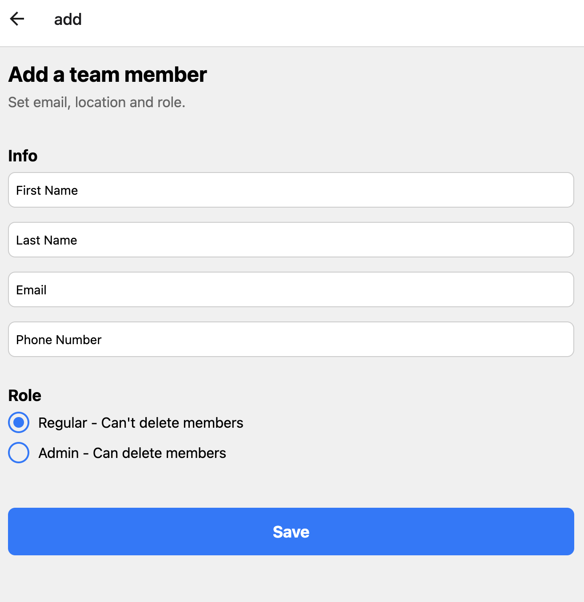

# Team Member Management Application

Welcome to the **Team Member Management Application**! This project is a web application that allows users to view, add, edit, and delete team members. It's built with a Django REST Framework backend and a React Native frontend (using Expo).

This README provides instructions for collaborators to set up the project locally for development.

---

## Table of Contents

- [Project Overview](#project-overview)
- [Technologies Used](#technologies-used)
- [Prerequisites](#prerequisites)
- [Getting Started](#getting-started)
  - [1. Clone the Repository](#1-clone-the-repository)
  - [2. Set Up the Backend](#2-set-up-the-backend)
  - [3. Set Up the Frontend](#3-set-up-the-frontend)
- [Project Structure](#project-structure)
- [Contributing](#contributing)
- [License](#license)

---

## Project Overview

The application allows users to manage team members with functionalities to:

- **List Team Members:** View all team members with their details.
- **Add Team Members:** Add new team members by providing their information.
- **Edit Team Members:** Update existing team member details.
- **Delete Team Members:** Remove team members from the list.

---

## Technologies Used

- **Backend:**

  - Python 3.11
  - Django 4.x
  - Django REST Framework
  - PostgreSQL (via Docker)

- **Frontend:**

  - React Native
  - Expo
  - TypeScript
  - react-native-unistyles (for styling)

  - **Tools:**
  - Docker (for PostgreSQL)
  - npm (Node Package Manager)

## Prerequisites

Before you begin, ensure you have met the following requirements:

- **Git:** For cloning the repository.
- **Python 3.11:** For running the backend.
- **Node.js (Latest LTS version):** For running the frontend.
- **npm:** Comes with Node.js.
- **Docker Desktop:** For running PostgreSQL in a Docker container.

## Getting Started

## Project Structure

The project is organized as follows:

```
team-management/
├── backend/
│   ├── manage.py
│   ├── requirements.txt
│   └── apps/
│       ├── users/
│       │   ├── models.py
│       │   ├── views.py
│       │   └── ...
├── frontend/
│   └── team-mgmt-ui/
│       ├── app/
│       │   ├── _layout.tsx
│       │   ├── add.tsx
│       │   ├── edit.tsx
│       │   └── index.tsx
│       ├── components/
│       │   └── RadioButton.tsx
│       ├── .env.example
│       ├── app.json
│       ├── package.json
│       └── ...
├── .gitignore
└── README.md
```

## Getting Started

To get a local copy up and running, follow these steps:

### 1. Clone the Repository

```bash
git clone https://github.com/soltran/team-management.git
cd team-management
```

---

### Backend Setup

1. Navigate to the backend directory:

   ```
   cd team-management/django
   ```

2. Create a virtual environment:

   ```
   python -m venv venv
   ```

3. Activate the virtual environment:

   - On Windows:
     ```
     venv\Scripts\activate
     ```
   - On macOS and Linux:
     ```
     source venv/bin/activate
     ```

4. Install the required packages:

   ```
   pip install -r requirements.txt
   ```

5. Set up environment variables:

   - Copy `.env.example` to `.env`
   - Update the `SECRET_KEY` and `DEBUG` in `.env`

6. Set Up the Database\*\*

We use PostgreSQL running in Docker.

##### **Start PostgreSQL with Docker**

```bash
docker run --name postgres \
  -e POSTGRES_PASSWORD=your_db_password \
  -p 5432:5432 \
  -d postgres
```

Replace `your_db_password` with a secure password.

6. Apply migrations:

```
python manage.py makemigrations users
python manage.py migrate users
python manage.py migrate
```

7. Seed the database with initial data:

```
python manage.py setup_test_data
```

8. Start the Django development server:
   ```
   python manage.py runserver
   ```

The backend API will be available at `http://localhost:8000/api/`.

### Frontend Setup

1. Navigate to the frontend directory:

   ```
   cd team-management/frontend/team-mgmt-ui
   ```

2. Install dependencies:

   ```
   yarn install
   ```

   or

   ```
   npm install
   ```

3. Set up environment variables:

   - Copy `.env.example` to `.env`
   - Update the `EXPO_PUBLIC_API_URL` in `.env` with your backend API URL (e.g., `http://localhost:8000/api`)

4. Start the Expo development server:

   ```
   npx expo start
   ```

5. Login with the following credentials to see all users across all companies:

   - Username: `admin`
   - Password: `adminpass`

6. Login with the following credentials to see only users in your company:

   - Username: `instawork_admin`
   - Password: `password`

7. Login with the following credentials to see a regular user in your company:

   - Username: `instawork_adam`
   - Password: `password`

8. Use the Expo Go app on your mobile device to scan the QR code, or run on an emulator.

**NOTE: Right now, only the web version is working. iOS and Android versions are coming soon.**

## Available Scripts

### Backend

In the `backend` directory, you can run:

- `python manage.py runserver`: Starts the Django development server.
- `python manage.py test`: Runs the backend tests.
- `python manage.py makemigrations`: Creates new migrations based on changes detected to your models.
- `python manage.py migrate`: Applies migrations to your database.

### Frontend

In the `frontend/team-mgmt-ui` directory, you can run:

- `npx expo start`: Starts the Expo development server.
- `npx expo start --web`: Starts the app in a web browser.
- `npx expo start --android` (Coming Soon): Starts the app on an Android emulator or connected device.
- `npx expo start --ios` (Coming Soon): Starts the app on an iOS simulator or connected device.

## Technologies Used

- Backend:

  - Django
  - Django REST framework
  - PostgreSQL

- Frontend:
  - React Native
  - Expo
  - TypeScript
  - react-native-unistyles (for styling)

## API Endpoints

The backend provides the following API endpoints:

- `GET /api/team-members/`: List all team members
- `POST /api/team-members/`: Create a new team member
- `GET /api/team-members/{id}/`: Retrieve a specific team member
- `PUT /api/team-members/{id}/`: Update a specific team member
- `DELETE /api/team-members/{id}/`: Delete a specific team member

## Roadmap

- [ ] Add iOS and Android versions
- [x] Add authentication
- [x] Add role based access control (only admin can add/edit/delete)
- [x] merge users and team members
- [x] Add team member avatars
- [ ] Add deployment
- [ ] Add CI/CD
- [ ] Add unit tests
- [ ] Add more features!
- [ ] Remove unistyles because it is not compatible with expo go
- [ ] Improve Theming

## Screenshots

List:


Add:


Edit:


## Contributing

Contributions are welcome! Please feel free to submit a Pull Request.

## License

This project is open source and available under the [MIT License](LICENSE).

## Contact

If you have any questions or feedback, please reach out to the repository owner.
